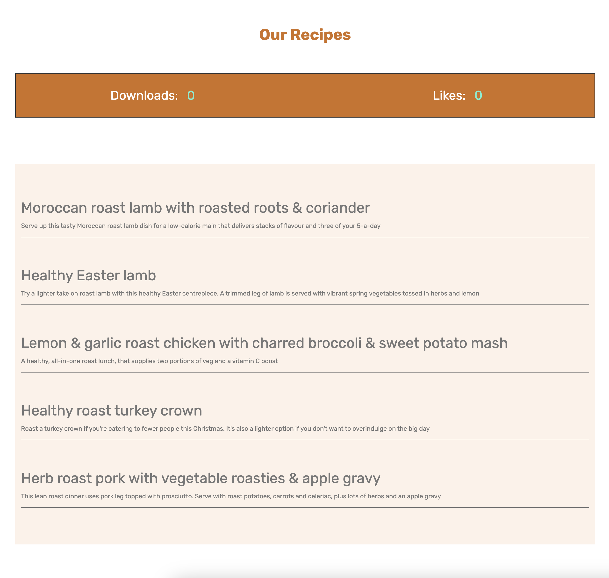
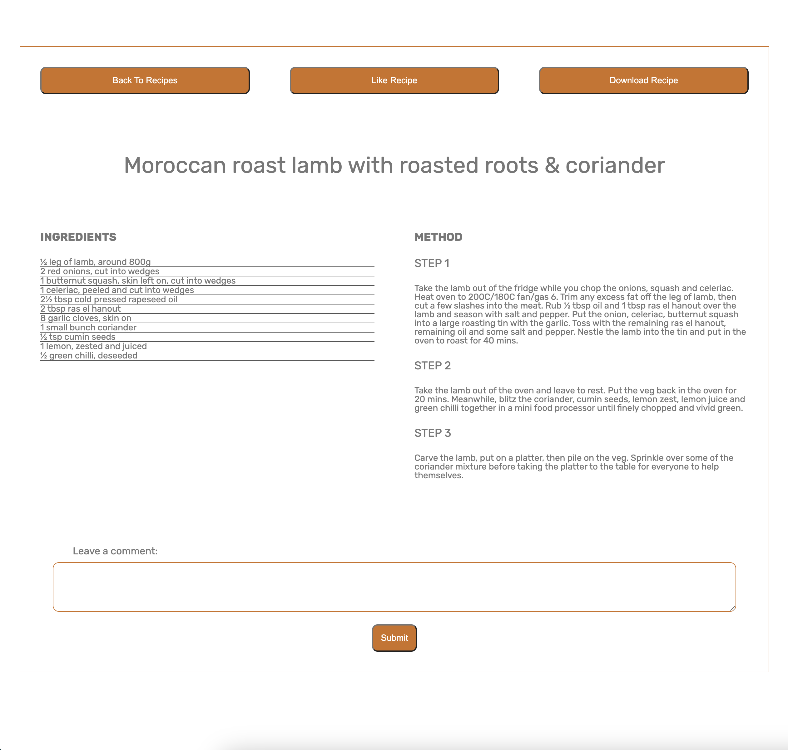

<h3 align="center">Restaurant Website</h3>

  A project I work for the Web Dev bootcamp at HyperionDev

<!-- TABLE OF CONTENTS -->
## Table Of Contents

  
Table of Contents

  <ol>
    <li><a href="#about-the-project">About The Project</a></li>
    <li><a href="#built-with">Built With</a></li>
    <li><a href="#installation">Installation</a></li>
    <li><a href="#usage">Usage</a></li>
    <li><a href="#contact">Contact</a></li>
  </ol>

<!-- ABOUT THE PROJECT -->
## About The Project

This is a capstone task for task 42. First we asked to create a plain HTML and CSS website back to the task 29 capstone. Now we have added functionality by adding Javascript.

(<a href="#readme-top">back to top</a>)

## Built With

* HTML
* CSS
* Javascript

(<a href="#readme-top">back to top</a>)

## Installation

Download the .zip file to get all the files to your local machine by using the following link
<a href="https://github.com/Aeolos71/restaurant-website/archive/refs/heads/main.zip">Download Zip</a>

(<a href="#readme-top">back to top</a>)

<!-- USAGE EXAMPLES -->
## Usage
At the recipes page you can find a list of our tasty recipes to try at home.

At the recipe details page you can find the ingredients and the method how to cook the awesome recipe you have choose.
Also you can comment, like or even download the recipe to your local machine storage.

(<a href="#readme-top">back to top</a>)

<!-- CONTACT -->
## Contact

<a href="https://aeolos.co.uk">Aeolos Web Development</a>

[linkedin](https://www.linkedin.com/in/dimitrios-dimitriou-638133146/) 

aeolos.developers@gmail.com

Project Link: https://github.com/Aeolos71/restaurant-website

(<a href="#readme-top">back to top</a>)

